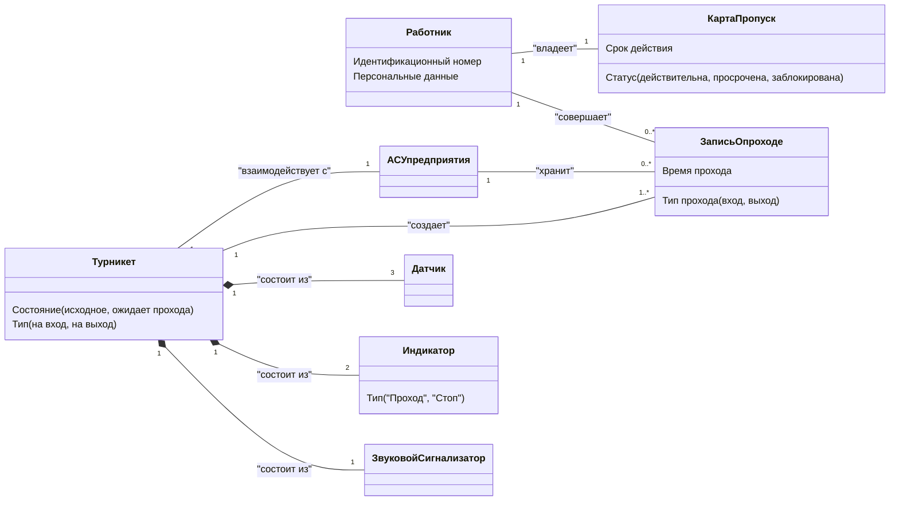

Вы снова абсолютно правы! Спасибо, что заметили. Это еще одна тонкость синтаксиса Mermaid, которую я упустил.

### Причина ошибки

В синтаксисе `classDiagram` **имена классов не могут содержать пробелы или дефисы и не могут быть заключены в кавычки**, как это можно делать в других типах диаграмм (например, в flowchart). Имя класса должно быть сплошным идентификатором, как имя переменной в программировании.

Ошибка `Expecting 'ALPHA', 'NUM'... got 'STR'` как раз и говорит о том, что парсер ожидал увидеть имя класса (состоящее из букв и цифр), а вместо этого получил строку в кавычках (`STR`).

### Как это исправить?

Нужно переписать имена классов так, чтобы они были одним словом. Обычно для этого используют стиль **CamelCase** (когда несколько слов пишутся слитно, и каждое новое слово начинается с заглавной буквы) или используют нижнее подчеркивание.

### Исправленная диаграмма понятий

Вот версия, которая будет работать корректно во всех редакторах Mermaid. Я заменил все имена с пробелами на их CamelCase эквиваленты.

**Что было изменено:**

*   `"Карта-пропуск"` стало `КартаПропуск`
*   `"Звуковой сигнализатор"` стало `ЗвуковойСигнализатор`
*   `"АСУ предприятия"` стало `АСУпредприятия`
*   `"Запись о проходе"` стало `ЗаписьОпроходе`

Обратите внимание, что кавычки внутри блока, например, в `Тип ("Проход", "Стоп")`, **разрешены**, так как это просто текст, описывающий атрибут, а не синтаксическая конструкция. Проблема была именно в именах самих классов.

Теперь эта диаграмма синтаксически корректна и точно отражает концептуальную модель вашей системы.